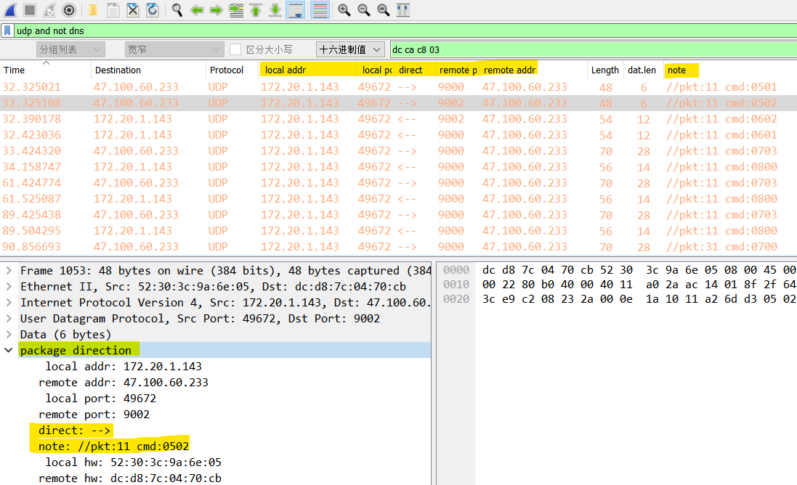

## usage

这是一个 wireshark 包解析插件.

- 安装方法: 放到 wireshark lua plugin 目录里, 重新加载 lua 插件.

  - NOTE1: 目录位置 wireshark 菜单 -> 帮助 -> 关于 -> 文件夹: `个人 Lua 插件` 或 `全局 Lua 插件`.
  - NOTE2: 重新加载 lua 插件: `Ctrl+Shift+L` 或 菜单 -> 分析 -> `重新载入 Lua 插件`.

- 使用方法:
wireshark 报文解析(分组详情窗口) 会多出 `package direction` 的项, 其中子项 可以右键 `显示为列`.

  - NOTE3: 其中右键 -> 协议首选项 -> open ..: 可以设置 `local mac` //插件通过 mac 区分报文 是收是发

- 使用效果:
主要为了提高包列表 的可读性

color rules highlight for recv:

    ip.direction.direct == "<--"

## udp_plug.lua
新加的一个 侵入式的 解析器.  
方便逐字节检视报文, 字段能够对应 hex 视图.  

并且内置各种常用类型 uint16, uint32, ipv4, string, timestamp; 开发起来非常便捷.

## display filter

▼基本操作

 `==` `!=`

▼字符串包含

 .note `contains` "pkt:11"

▼字节流比较  

 .cmd == 0700  
 .cmd[1] == 00  
 .cmd[0:2] == 0700

ref:  
https://www.wireshark.org/docs/man-pages/wireshark-filter.html#The-slice-operator

## profile
预前配置好的 columns, layout, color rules (直接导入 可避免手动在 GUI 里再配置一遍)

用法:

    cp -pvrT profile_chen ~/.config/wireshark/profiles/chen

// win 系统 参见 NOTE1, 找 configuration 目录
